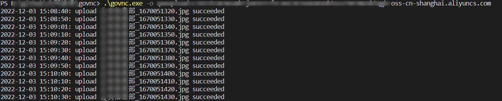
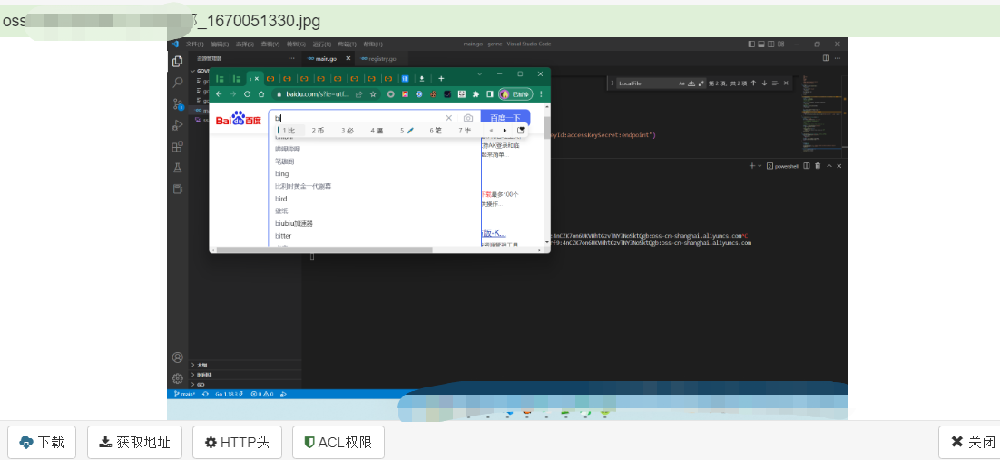

# GoVnc

GoVnc是使用go+阿里云oss实现对屏幕（截屏）进行监控。截屏后进行实时上传操作，从而达到屏幕监控的效果。

仅供学习使用，请勿用作非法用途！
详细使用：https://www.yuque.com/pantom/web/txcveqczgc3h8at2

## 工具使用

### 下载：
```
git clone https://github.com/pantom2077/GoVnc.git
cd .\GoVnc\
go build
```

### 参数

```bash
govnc.exe -h
Usage of C:\Users\pantom\AppData\Local\Temp\go-build1534796666\b001\exe\main.exe:
  -o string
        format: bucketName:accessKeyId:accessKeySecret:endpoint 指定阿里云参数：名称：Accesskey ID ：AccessKeySecret：所在区的地址
  -s int
        second (default 30) 默认是30秒截屏 上传 可以指定时间
```

### 效果



### 查看图片



